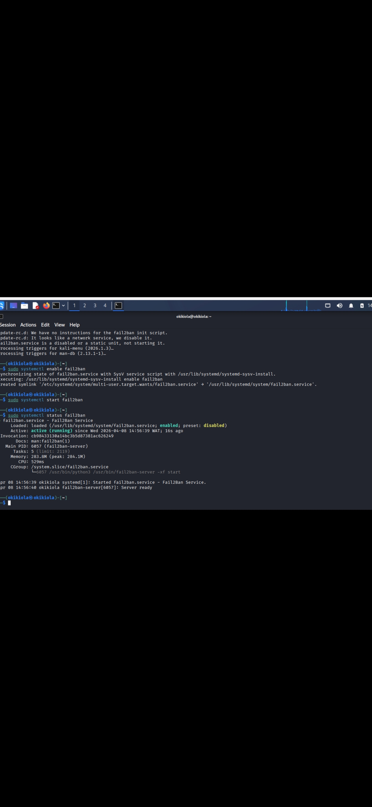
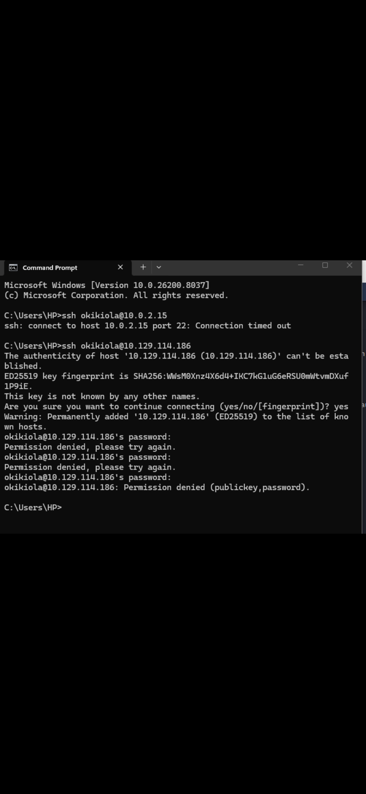
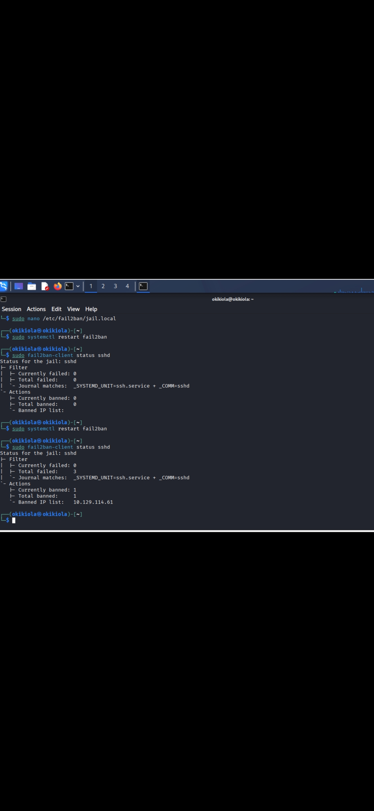
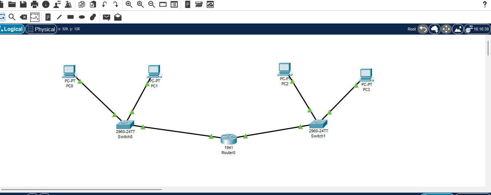
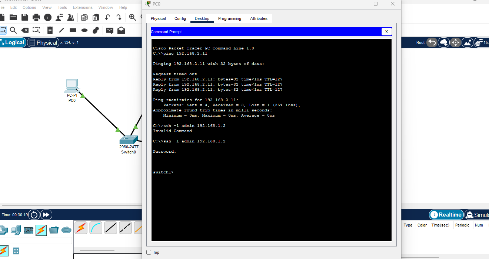

# ssh-fail2ban-network-security-lab
SSH Hardening with Fail2Ban &amp; Secure Remote Network Access (Packet Tracer)
# 🔐 SSH Hardening with Fail2Ban & Secure Remote Access

## 📌 Project Overview
This project demonstrates how to secure a system against brute force attacks using SSH and Fail2Ban, as well as how to configure secure remote access to network devices using Cisco Packet Tracer.

---

## 🛠️ Technologies Used
- Kali Linux
- SSH (OpenSSH)
- Fail2Ban
- Cisco Packet Tracer

---

## 🔐 Task 1: SSH + Fail2Ban (Kali Linux)
### ⚙️ Fail2Ban Service Running

Fail2Ban service was successfully enabled and is actively running.

### ✅ Objectives
- Configure SSH using password authentication
- Simulate brute force attack attempts
- Configure Fail2Ban to block attacker IP after 3 failed attempts
SSH permission denied.jpg
### ⚙️ Configuration
- Max retry: 3
- Find time: 5 minutes
- Ban time: 5 minutes
### 🚫 Failed SSH Login Attempts

Multiple failed login attempts were detected on the system.

### 🧪 Results
- Failed login attempts were detected
- Attacker IP was automatically banned
- Logs confirmed blocking activity
### 🔒 Fail2Ban Blocking Attacker

After repeated failed login attempts, Fail2Ban automatically blocked the attacking IP address.

---

## 🌐 Task 2: Network SSH Configuration (Packet Tracer)

### ✅ Objectives
- Build a network topology with two LANs
- Connect networks using a router
- Configure SSH on a switch
- Remotely access the switch from a PC

### ⚙️ Configuration
- Switch IP: 192.168.1.2
- Router gateways: 192.168.1.1 / 192.168.2.1
- SSH user: admin

### 🧪 Results
- Successful ping between networks
- SSH login to switch successful
- Secure remote management achieved
## 🌐 Network Topology

This shows the network design used for the lab, including router, switch, and connected devices.

---

### 🔗 Connectivity Test

Tested connectivity between devices using ping.

---

## 

### 🔹 Fail2Ban Blocking Attacker
(SSH permission denied.jpg)

### 🔹 Network Topology
(Add your screenshot here)

### 🔹 Ping Test
(Add your screenshot here)

### 🔹 SSH Login Success
(Add your screenshot here)

---

## 🎯 Key Skills Demonstrated
- Linux system security
- SSH configuration
- Brute force attack simulation
- Intrusion prevention (Fail2Ban)
- Network configuration (Cisco)
- Remote device management

---

## 📚 Conclusion
This project demonstrates practical implementation of securing systems against brute force attacks and configuring secure remote access in a network environment.

---

## 👨‍💻 Author
Okikiola 
